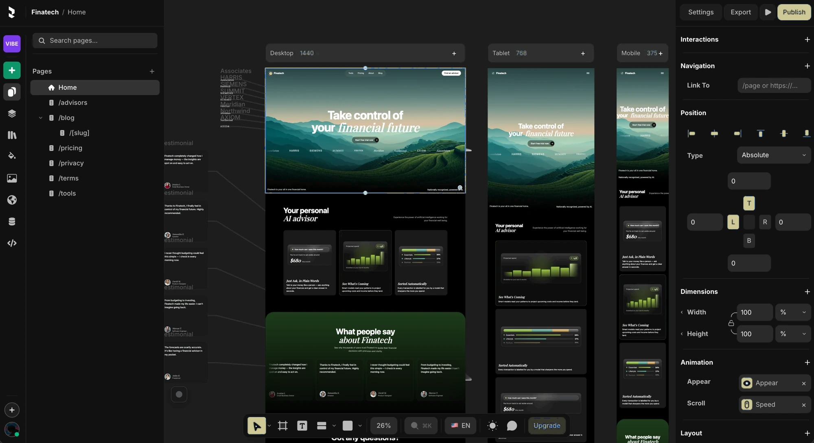
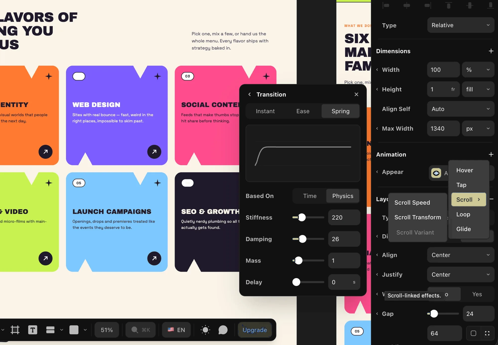
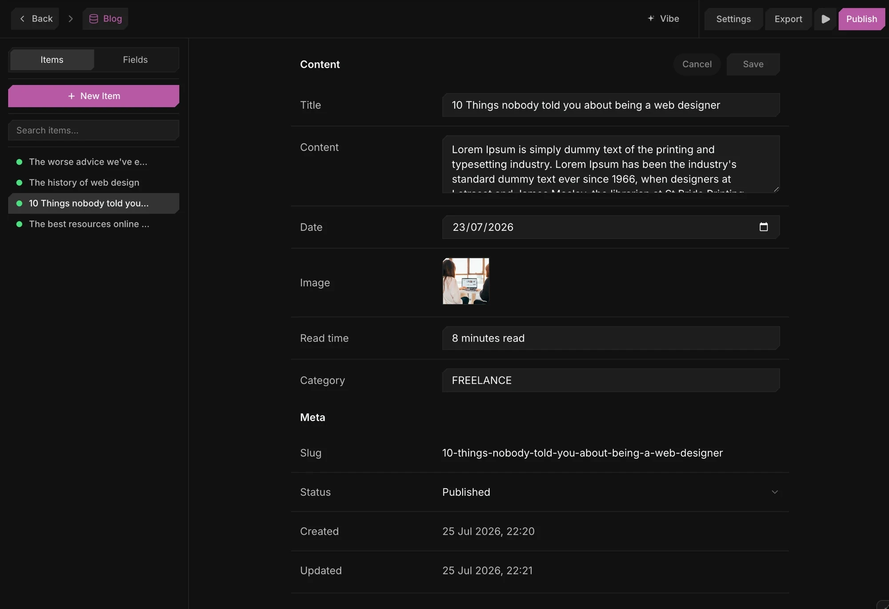
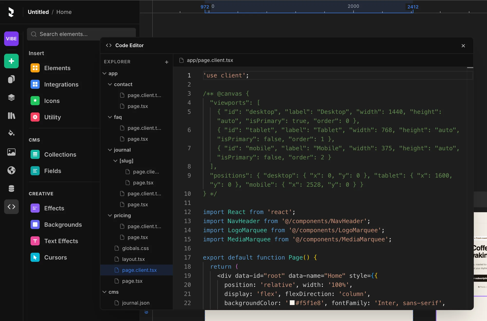
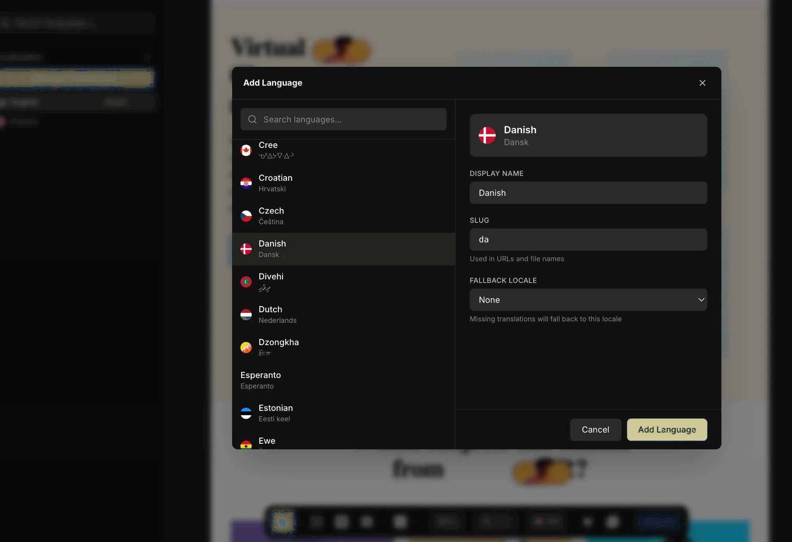

# Revyme

**Design websites with pixel-perfect control. Ship real code you own.**

[](https://discord.gg/8f6UpuQHRN)

[](./LICENSE)
[](https://revyme.com)

Revyme is an open-source visual website builder. You design on a canvas - drag, resize, build components, animate - and you get a clean Next.js project you can read, edit, deploy anywhere, and keep forever.

No proprietary file format. No export step that mangles your work. No lock-in.

> **Questions, ideas, or want to show what you built?**
> [Join the Revyme Discord](https://discord.gg/8f6UpuQHRN) - it's the fastest way to get help.



## Who it's for

- **Designers** who want real control - precise layout, motion and typography - without writing code
- **Developers** who want to build UI visually and still own clean, readable source
- **Agencies and teams** who need to hand off a project a client can actually keep
- **Anyone leaving a hosted builder** and tired of paying rent on their own website

If you've used Framer or Webflow and wished you could take the code with you, that's the gap
this fills.

## What you can build

**Components and variants.** Turn any selection into a reusable component. Give it visual
states - default, hover, open, whatever you need - and wire them together with clicks, hovers
and scroll triggers. No state machines to hand-write.

**Genuinely responsive layouts.** Design on desktop, then adjust tablet and mobile directly.
Add custom breakpoints whenever you want. Overrides are real CSS, not approximations.

**A real CMS.** Typed collections, filtered and sorted lists, pagination, and detail pages on
dynamic routes. Bind any field to any element by pointing at it.

**Motion that feels designed.** Spring physics, easing curves, scroll-linked transforms, text
effects and per-character reveals - all tuned visually with live preview.



**Multiple languages.** Add a locale, translate inline, and every visitor gets the right
content, URLs and SEO metadata. Right-to-left included.

**Forms, plugins, and more.** A visual form builder with a self-hostable submit relay, plus a
plugin SDK if you want to extend the editor itself.



## The code is yours

Every edit writes real source. Open the code panel at any moment and you'll find an ordinary
Next.js project - `app/`, `components/`, `cms/` - that any React developer can pick up.

Deploy it to Vercel, Netlify, your own server, anywhere. Hand it to a developer. Fork it and
never open Revyme again. It's your code.



## Quickstart

```bash
npm ci
npm run dev
```

Then open **http://localhost:3333**.

`npm run dev` starts three Vite servers - all are required:

| Port | What it serves |
|------|----------------|
| 3333 | the editor |
| 5174 | the canvas sandbox iframe (your page, rendered live) |
| 5175 | the preview sandbox (the "play" preview) |

Your work saves to `localStorage` automatically in local mode. No account, no backend, no
network required.

### Optional configuration

Everything is optional - see [`.env.example`](./.env.example) for the annotated list.

| Variable | Purpose |
|----------|---------|
| `VITE_GOOGLE_FONTS_KEY` | Google Fonts picker (falls back to a bundled list) |
| `VITE_UNSPLASH_ACCESS_KEY` / `VITE_PIXABAY_KEY` | stock image/video search tabs (hidden without keys) |
| `VITE_REVYME_CLOUD` | set to `true` only when running against the hosted cloud backend |
| `VITE_CDN_HOST` / `VITE_PLATFORM_HOST` | point a self-hosted fork at your own asset CDN / platform |



## How it works

Three ideas, if you're curious what's under the canvas:

**The JSX is the source of truth.** The editor parses your page's `.tsx` into a node map,
renders it, and every edit rewrites that JSX. Undo, code export and consistency all fall out
of one loop: parse → render → edit → regenerate.

**Edits are imperative, commits are canonical.** During a drag the canvas is patched directly
at 60fps; the source is rewritten once, when you let go. Fluid to use, exact in the file.

**Your page runs in a sandbox.** Canvas content lives in a sandboxed iframe, so page code can
never reach the editor. Geometry and style cross a `postMessage` bridge backed by synced
caches.

[CLAUDE.md](./CLAUDE.md) has the full architecture guide.

## Contributing

```bash
npx tsc --noEmit          # typecheck
npx vitest run            # unit tests
VITE_REVYME_CLOUD= npx playwright test   # e2e against the dev servers
```

See [CONTRIBUTING.md](./CONTRIBUTING.md) for the contributor guide. Issues and pull requests
are welcome - bug reports with a reproduction are especially useful.

## License

[AGPL-3.0](./LICENSE), with an additional notice-preservation term under AGPL section 7(b) -
see [NOTICE](./NOTICE).

In short: you're free to use, modify, and self-host Revyme. If you offer a modified version to
others over a network (e.g. run it as a service), the AGPL requires you to publish the source
of your modified version. The copyright notices and the NOTICE file must stay intact, and the
Revyme name and logo are trademarks - forks need their own branding.

**Commercial licensing.** If your organization can't accept the AGPL's obligations
(proprietary modifications, embedding Revyme in a closed-source product, or offering it as a
service without source disclosure), a commercial license is available: **hello@revyme.com**.
