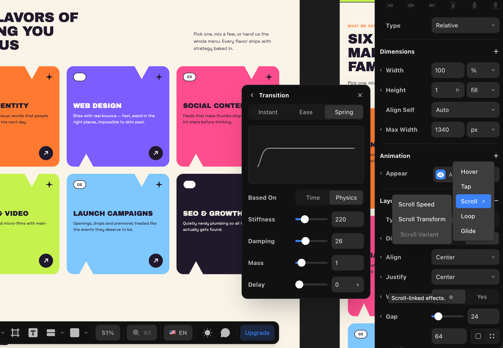
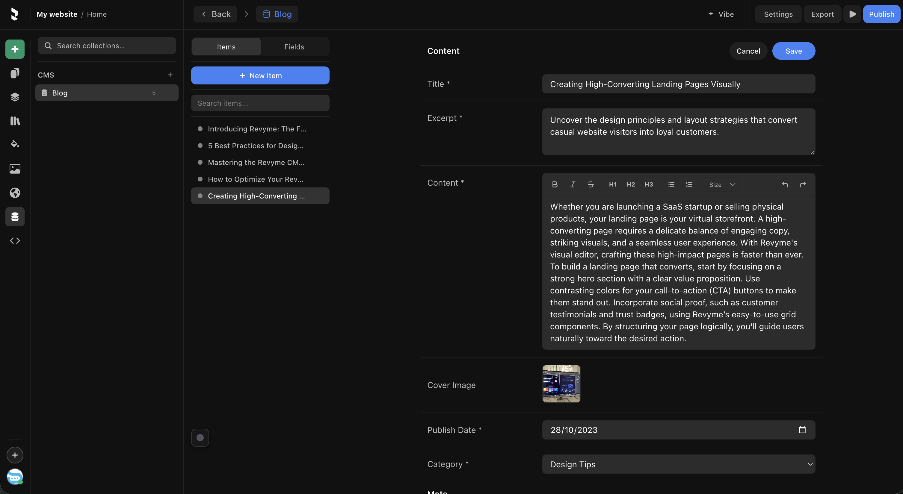
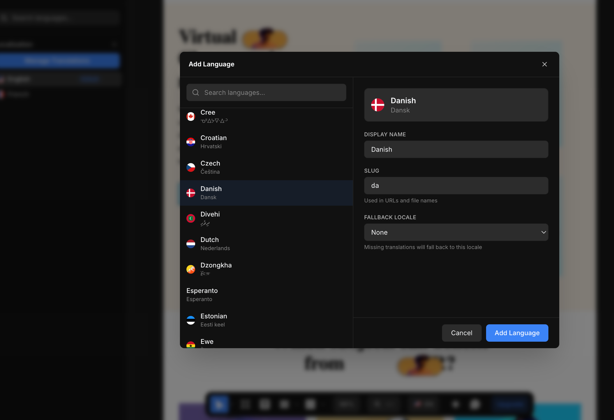

# Revyme

**A visual, code-first website builder — the React code *is* the document.**

[](./LICENSE)
[](https://revyme.com)
[](https://discord.gg/8f6UpuQHRN)

Revyme is a professional-grade canvas editor where every drag, resize, style tweak and
animation writes real, deployable Next.js/React + framer-motion source code. There
is no proprietary document format: the page you edit on the canvas is the `.tsx`
file you ship.


## Features

- **Design components & variants** — extract any selection into a reusable
  component; visual variants are framer-motion states with connections
  (click / hover / in-view) and per-variant overrides.
- **True responsive breakpoints** — desktop is the source of truth; tablet and
  mobile replicas write real `@media` overrides. Add custom breakpoints freely.
- **CMS** — collections with typed fields, collection lists with filters,
  multi-field sort and pagination (Load More / infinite scroll), detail pages
  bound through dynamic routes.
- **Animations** — appear/hover/tap/loop effects, scroll transforms, scroll
  variants, text effects and CSS keyframes, all authored visually and emitted as
  framer-motion code.
- **Localization** — per-locale content, URLs and SEO metadata; visual inline
  translation, locale-aware formatting and RTL support.
- **Forms** — visual form builder with a submit pipeline, loading/success/error
  states and a self-hostable relay worker.
- **Plugin SDK** — build editor plugins against `@revyme/plugin-sdk` with a
  permissioned RPC surface.
- **Code export** — the project is a standard Next.js app tree
  (`app/`, `components/`, `cms/`) at every moment.

### Motion & interactions

Spring physics, easing curves, and per-trigger effects (hover / tap / scroll /
loop) — tuned visually, written as framer-motion code.



### Built-in CMS

Typed collections, visual field binding, filtered and paginated collection
lists, and detail pages on dynamic routes.



### Localization

Add a locale in one dialog — slug, display name, fallback — then translate
inline and serve every visitor the right language.



### Code export

What you see in the code panel is what you ship: a standard Next.js project,
readable at every moment.


## Quickstart

```bash
npm ci
npm run dev
```

Then open **http://localhost:3333**.

`npm run dev` starts three Vite servers — all are required:

| Port | What it serves |
|---|---|
| `3333` | the editor |
| `5174` | the canvas sandbox iframe (your page, rendered live) |
| `5175` | the preview sandbox (the "play" preview) |

Your work is saved to `localStorage` automatically in local mode.

## Environment variables

Everything is optional in local mode — see [`.env.example`](./.env.example) for
the full annotated list. Highlights:

| Variable | Purpose |
|---|---|
| `VITE_GOOGLE_FONTS_KEY` | Google Fonts picker (falls back to a bundled list) |
| `VITE_UNSPLASH_ACCESS_KEY` / `VITE_PIXABAY_KEY` | stock image/video search tabs (hidden without keys) |
| `VITE_REVYME_CLOUD` | set to `true` only when running against the hosted cloud backend — leave unset for local use |
| `VITE_CDN_HOST` / `VITE_PLATFORM_HOST` | point a self-hosted fork at your own asset CDN / platform |

## Architecture in three paragraphs

**The JSX is the source of truth.** The editor parses the active page's `.tsx`
into a node map, renders it, and every edit is a queued *mutation* that rewrites
the JSX through focused generator modules. Undo/redo, multiplayer-style
consistency and code export all fall out of this one-way loop: parse → render →
edit → regenerate.

**Imperative-first pipeline.** During a drag or slider gesture the canvas DOM and
an in-memory node cache are patched imperatively at 60fps; the JSX write happens
once, on commit. That keeps the canvas fluid while the source stays canonical.

**The iframe bridge.** Canvas content runs in a sandboxed cross-origin iframe so
user code can't touch the editor. All geometry reads and style writes cross a
postMessage bridge (`src/canvas-sandbox/`) backed by synchronized rect/computed
caches for 60fps interactions.

## Testing

```bash
npx tsc --noEmit          # typecheck (0 errors)
npx vitest run            # unit tests
VITE_REVYME_CLOUD= npx playwright test   # e2e against the dev servers
```

See [CONTRIBUTING.md](./CONTRIBUTING.md) for the full contributor guide.

## License

[AGPL-3.0](./LICENSE), with an additional notice-preservation term under
AGPL section 7(b) — see [NOTICE](./NOTICE).

In short: you're free to use, modify, and self-host Revyme. If you offer a
modified version to others over a network (e.g. run it as a service), the
AGPL requires you to publish the source of your modified version. The
copyright notices and the NOTICE file must stay intact, and the Revyme name
and logo are trademarks — forks need their own branding.

**Commercial licensing.** If your organization can't accept the AGPL's
obligations (proprietary modifications, embedding Revyme in a closed-source
product, or offering it as a service without source disclosure), a
commercial license is available: **hello@revyme.com**.
